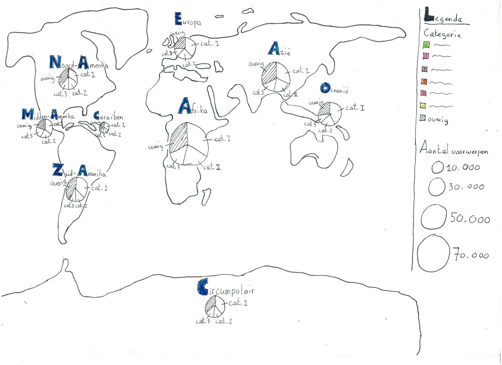

# Visualisatie collectie Nationaal Museum van Wereldculturen

Voor een nieuwe tentoonstelling over de collectie van het Tropenmuseum in Amsterdam wil tentoonstellingmaker Rik Herder met visualisaties laten zien wat er in een groter geheel te vinden is in de collectie van het Nationaal Museum van Wereldculturen. Zijn insteek is om de iconen van de collectie uit te lichten. Hij heeft de opdracht gegeven om een van zo'n visualisatie te laten maken.

De datavisualisatie is gemaakt met **d3**. Verder zijn Node.js en Express gebruikt voor het bouwen van de applicatie.


**[Bekijk datavisualisatie](https://qiubee.github.io/nmvw-chart/)**

## Benodigdheden

* [Node.js](https://nodejs.org/en/)
* [Express](https://expressjs.com/)
* [d3](https://d3js.org/)

Andere benodigdheden zijn te vinden in [`package.json`](https://github.com/qiubee/functional-programming/blob/master/package.json)

## Concept

Een datavisualisatie die de collectie van het Nationaal Museum van Wereldculturen laat zien. Door middel van een wereldkaart wordt er met bolletjes weergegeven hoeveel objecten er per werelddeel in de collectie zitten. In de bolletjes wordt een cirkeldiagram getoond die de top 3 laat zien van categorieën waar de meeste objecten in te vinden zijn.



## Installeren

Om het project te installeren typ het volgende in de terminal:

1. `git clone https://github.com/qiubee/functional-programming.git`
2. `npm install`
3. `npm start`

Gebruik `localhost:8000` in de browser om de app te bekijken.

## Data

De data wordt opgehaald uit de API van het NMVW. Het NMVW gebruikt SPARQL voor het ophalen van data uit de collectie. De data die daaruit wordt opgehaald is:

* Geografische herkomst
* Categorie
* Aantal objecten

In SPARQL zijn `dct:spatial` en `edm:isRelatedTo` gebruikt om de plaats en de categorie van het object op te halen. En met `(COUNT() AS())` zijn de objecten bij elkaar opgeteld.

Hieronder staat de query die is gebruikt voor het ophalen van de data:

```SPARQL
PREFIX rdf: <http://www.w3.org/1999/02/22-rdf-syntax-ns#>
PREFIX dc: <http://purl.org/dc/elements/1.1/>
PREFIX dct: <http://purl.org/dc/terms/>
PREFIX skos: <http://www.w3.org/2004/02/skos/core#>
PREFIX edm: <http://www.europeana.eu/schemas/edm/>

SELECT ?continent ?category (COUNT(?obj) AS ?objCount) WHERE {

# CONTINENTEN
# zoekt alle continenten
<https://hdl.handle.net/20.500.11840/termmaster2> skos:narrower ?geoTerm .
?geoTerm skos:prefLabel ?continent .

# geeft per continent de onderliggende geografische termen
?geoTerm skos:narrower* ?allGeoTerms .

# geeft objecten bij de onderliggende geografische termen
?obj dct:spatial ?allGeoTerms .

# CATEGORIEEN
# zoekt alle hoofdcategorieen
<https://hdl.handle.net/20.500.11840/termmaster2802> skos:narrower ?catTerm .
?catTerm skos:prefLabel ?category .

# geeft per categorie alle onderliggende categorische termen
?catTerm skos:narrower* ?allCatTerms .

# geeft objecten bij alle onderliggende categorische termen
?obj edm:isRelatedTo ?allCatTerms

}
GROUP BY ?continent ?category
ORDER BY DESC(?objCount)
```

### Opschonen data

Hoe het data-opschoon-patroon gemaakt is, is te zien in de wiki bij **[Proces data opschonen (NMVW)](https://github.com/qiubee/functional-programming/wiki/Proces-data-opschonen-(collectie-NMWV))**.

Ook is de data van een studentenenquete opgeschoond d.m.v. functional programming. Dit is te vinden in de wiki bij **[Proces data opschonen (studentenenquête)](https://github.com/qiubee/functional-programming/wiki/Proces-data-opschonen-(studentenenqu%C3%AAte))**.

## Gebruikte voorbeelden

* [Lollipop chart](https://www.d3-graph-gallery.com/graph/lollipop_horizontal.html)
* [Chart interaction](https://vizhub.com/Razpudding/c635efa650a3433f830c7fb656d9c138?edit=files&file=index.js)

## Licentie

**[MIT](https://github.com/qiubee/functional-programming/blob/master/LICENSE)**
